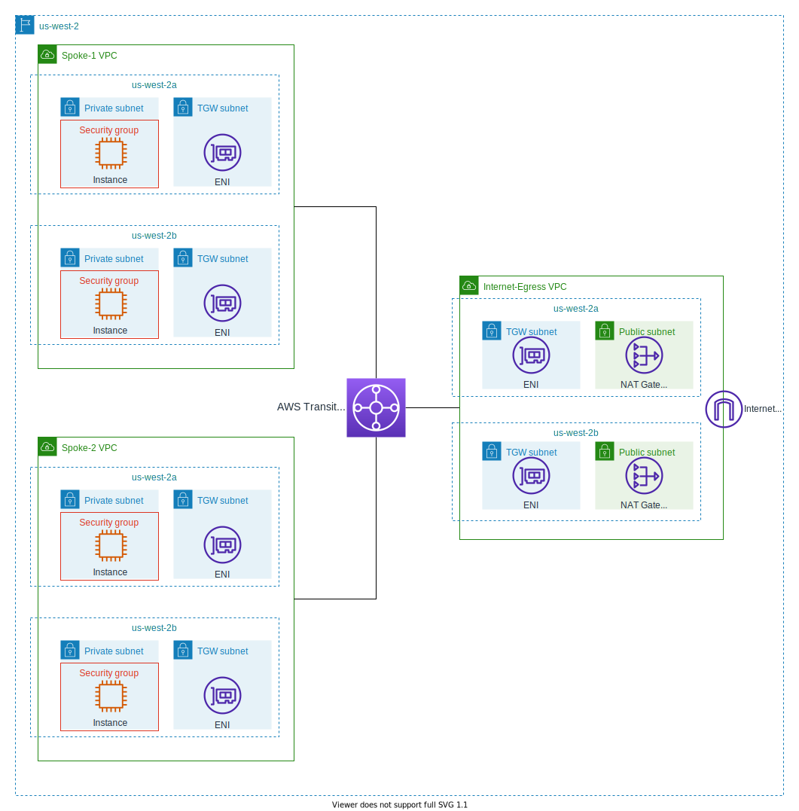

# Centralized Internet Egress for IPv4 traffic

## Architecture Diagram

## Goals
- Communication between the Spoke-1 and Spoke-2 VPCs should not be allowed.
- Resources in the Spoke-1 and Spoke-2 VPCs must access the Internet through the NAT Gateway in the Internet-Egress VPC. The NAT Gateway connects to the Internet Gateway in the Internet-Egress VPC.
- For high availability, resources in the Spoke-1, Spoke-2, and Internet-Egress VPCs should be placed in more than one availability zone.

## VPCs
<table>
  <tr>
    <th scope="col">Name</th>
    <th scope="col">VPC ID</th>
    <th scope="col">IPv4 CIDR</th>
  <tr>
  <tr>
    <td>Spoke-1</td>
    <td>vpc-07be9efcb92f97976</td>
    <td>10.0.0.0/16</td>
  </tr>
  <tr>
    <td>Spoke-2</td>
    <td>vpc-05f13d8cf9a39061f</td>
    <td>10.1.0.0/16</td>
  </tr>
  <tr>
    <td>Internet-Egress</td>
    <td>vpc-0db0cedf0aeb66580</td>
    <td>10.2.0.0/16</td>
  </tr>
</table>

## Route Tables associated with subnets
### Route tables for private subnets in Spoke-1 VPC containing EC2 instances
- rtb-04e452a72626626e0 / VPC-Spoke-1-private-rt-us-west-2a for subnet-071e8f2715b3ce110 / VPC-Spoke-1-private-us-west-2a
- rtb-07406de34779c3e96 / VPC-Spoke-1-private-rt-us-west-2b for subnet-04ffe804f802f0e98 / VPC-Spoke-1-private-us-west-2b
<table>
  <tr>
    <th scope="col">Destination</th>
    <th scope="col">Target</th>
  </tr>
  <tr>
    <td>10.0.0.0/16</td>
    <td>local</td>
  </tr>
  <tr>
    <td>0.0.0.0/0</td>
    <td>tgw-0aa71533e2e48c4e4</td>
  </tr>
</table>

### Route tables for private subnets in Spoke-2 VPC containing EC2 instances
- rtb-0d9e3d74c2a690d76 / VPC-Spoke-2-private-rt-us-west-2a for subnet-08ba9c51746f04ed6 / VPC-Spoke-2-private-us-west-2a
- rtb-0f7382d31eddb451f / VPC-Spoke-2-private-rt-us-west-2b for subnet-0d33fd63ae39f8aea / VPC-Spoke-2-private-us-west-2b
<table>
  <tr>
    <th scope="col">Destination</th>
    <th scope="col">Target</th>
  </tr>
  <tr>
    <td>10.1.0.0/16</td>
    <td>local</td>
  </tr>
  <tr>
    <td>0.0.0.0/0</td>
    <td>tgw-0aa71533e2e48c4e4</td>
  </tr>
</table>

### Route tables for private (Transit Gateway) subnets in Spoke-1 VPC
- rtb-0b37caf8cd5ad3c75 for subnet-04077b70392cf1aaa / VPC-Spoke-1-TGW-us-west-2a and subnet-09a41f8f71a337d08 / VPC-Spoke-1-TGW-us-west-2b
<table>
  <tr>
    <th scope="col">Destination</th>
    <th scope="col">Target</th>
  </tr>
  <tr>
    <td>10.0.0.0/16</td>
    <td>local</td>
  </tr>
</table>

### Route tables for private (Transit Gateway) subnets in Spoke-2 VPC
- rtb-06fa1583e5e39a26a for subnet-0f27c257788135397 / VPC-Spoke-2-TGW-us-west-2a and subnet-0e3f13877eb027ee4 / VPC-Spoke-2-TGW-us-west-2b
<table>
  <tr>
    <th scope="col">Destination</th>
    <th scope="col">Target</th>
  </tr>
  <tr>
    <td>10.1.0.0/16</td>
    <td>local</td>
  </tr>
</table>

### Route tables for private (Transit Gateway) subnets in Internet-Egress VPC
- rtb-014ee79d529a7f200 / VPC-Internet-Egress-TGW-rt-us-west-2a for subnet-03a7bf42e263f9921 / VPC-Internet-Egress-TGW-us-west-2a
<table>
  <tr>
    <th scope="col">Destination</th>
    <th scope="col">Target</th>
  </tr>
  <tr>
    <td>10.2.0.0/16</td>
    <td>local</td>
  </tr>
  <tr>
    <td>10.0.0.0/15</td>
    <td>tgw-0aa71533e2e48c4e4</td>
  </tr>
  <tr>
    <td>0.0.0.0/0</td>
    <td>nat-0ad936fce69d97149</td>
  </tr>
</table>

- rtb-0f7382d31eddb451f / VPC-Spoke-2-private-rt-us-west-2b for subnet-0d33fd63ae39f8aea / VPC-Spoke-2-private-us-west-2b
<table>
  <tr>
    <th scope="col">Destination</th>
    <th scope="col">Target</th>
  </tr>
  <tr>
    <td>10.2.0.0/16</td>
    <td>local</td>
  </tr>
  <tr>
    <td>10.0.0.0/15</td>
    <td>tgw-0aa71533e2e48c4e4</td>
  </tr>
  <tr>
    <td>0.0.0.0/0</td>
    <td>nat-0ab01130031652a50</td>
  </tr>
</table>

### Route tables for public subnets (each containing a NAT Gateway) in Internet-Egress VPC
- rtb-076d506a6dfaf72ef / VPC-Internet-Egress-NATGW-rt-us-west-2a for subnet-0733126d966df740a / VPC-Internet-Egress-NATGW-us-west-2a
- rtb-03392240813f539e1 / VPC-Internet-Egress-NATGW-rt-us-west-2b for subnet-052087b7a7424b343 / VPC-Internet-Egress-NATGW-us-west-2b
<table>
  <tr>
    <th scope="col">Destination</th>
    <th scope="col">Target</th>
  </tr>
  <tr>
    <td>10.2.0.0/16</td>
    <td>local</td>
  </tr>
  <tr>
    <td>10.0.0.0/15</td>
    <td>tgw-0aa71533e2e48c4e4</td>
  </tr>
  <tr>
    <td>0.0.0.0/0</td>
    <td>igw-01168f17c1b78892c</td>
  </tr>
</table>

## Transit Gateway
<table>
  <tr>
    <th scope="col">Name</th>
    <th scope="col">Transit gateway ID</th>
  </tr>
  <tr>
    <td>TGW1</td>
    <td>tgw-0aa71533e2e48c4e4</td>
  </tr>
</table>

## Transit Gateway Attachments
<table>
  <tr>
    <th scope="col">Name</th>
    <th scope="col">Transit gateway attachment ID</th>
    <th scope="col">Transit gateway ID</th>
    <th scope="col">Resource type</th>
    <th scope="col">Association route table ID</th>
  </tr>
  <tr>
    <td>Spoke-1-VPC-TGW-attachment</td>
    <td>tgw-attach-0f724a467259b6d4d</td>
    <td>tgw-0aa71533e2e48c4e4</td>
    <td>VPC</td>
    <td>tgw-rtb-0c2c927b932bd854d / Spoke-route-table</td>
  </tr>
  <tr>
    <td>Spoke-2-VPC-TGW-attachment</td>
    <td>tgw-attach-0b9eff5594adf7653</td>
    <td>tgw-0aa71533e2e48c4e4</td>
    <td>VPC</td>
    <td>tgw-rtb-0c2c927b932bd854d / Spoke-route-table</td>
  </tr>
  <tr>
    <td>Internet-Egress-VPC</td>
    <td>tgw-attach-0a708816c939093f6</td>
    <td>tgw-0aa71533e2e48c4e4</td>
    <td>VPC</td>
    <td>tgw-rtb-0a66b73e6baad4e28 / Egress-route-table</td>
  </tr>
</table>

## Transit Gateway Route Tables
### tgw-rtb-0c2c927b932bd854d / Spoke-route-table
<table>
  <tr>
    <th scope="col">CIDR</th>
    <th scope="col">Attachment ID</th>
    <th scope="col">Resource ID</th>
    <th scope="col">Resource type</th>
    <th scope="col">Route type</th>
    <th scope="col">Route state</th>
  </tr>
  <tr>
    <td>0.0.0.0/0</td>
    <td>tgw-attach-0a708816c939093f6</td>
    <td>vpc-0db0cedf0aeb66580 / Internet-Egress</td>
    <td>VPC</td>
    <td>Static</td>
    <td>Active</td>
  </tr>
  <tr>
    <td>10.0.0.0/15</td>
    <td>–</td>
    <td>–</td>
    <td>–</td>
    <td>Static</td>
    <td>Blackhole</td>
  </tr>
</table>

### tgw-rtb-0a66b73e6baad4e28 / Egress-route-table
<table>
  <tr>
    <th scope="col">CIDR</th>
    <th scope="col">Attachment ID</th>
    <th scope="col">Resource ID</th>
    <th scope="col">Resource type</th>
    <th scope="col">Route type</th>
    <th scope="col">Route state</th>
  </tr>
  <tr>
    <td>10.0.0.0/16</td>
    <td>tgw-attach-0f724a467259b6d4d</td>
    <td>vpc-07be9efcb92f97976 / Spoke-1</td>
    <td>VPC</td>
    <td>Static</td>
    <td>Active</td>
  </tr>
  <tr>
    <td>10.1.0.0/16</td>
    <td>tgw-attach-0b9eff5594adf7653</td>
    <td>vpc-05f13d8cf9a39061f / Spoke-2</td>
    <td>VPC</td>
    <td>Static</td>
    <td>Active</td>
  </tr>
</table>

## EC2 instance type
For this project, the t3.micro instance type was used for cost optimization purposes.

## Security group for EC2 instances
The example security group allows the following traffic:
- Allow instances to communicate to any destination IPv4 address and destination TCP port 80 (HTTP) (and allow return traffic)
- Allow instances to communicate to any destination IPv4 address and destination TCP port 443 (HTTPS) (and allow return traffic)