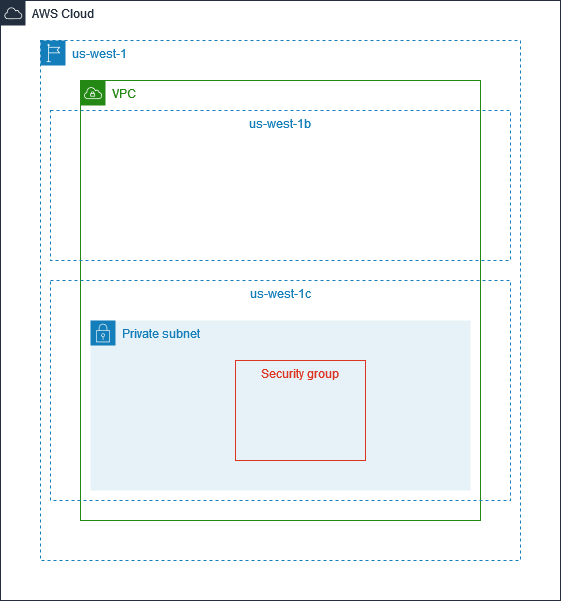
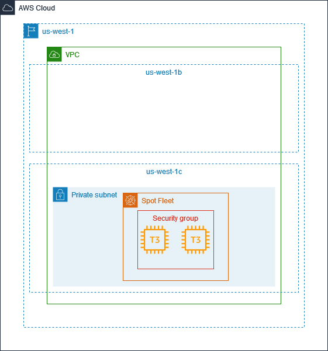

# Create a launch template and an EC2 Spot Fleet request using Terraform in AWS

## Prerequisites

- The service-linked role named `AWSServiceRoleForEC2SpotFleet` must exist.
- The service-linked role named `AWSServiceRoleForEC2Spot` must exist.
- The role named `aws-ec2-spot-fleet-tagging-role` must exist.

To allow an Identity and Access Management (IAM) user to create or manage a Spot Fleet, I created an IAM user group and attached an IAM policy to the IAM user group. The IAM policy I used can be found in the `custom-IAM-policy.json` file.

## Architecture

While not strictly required, a custom Virtual Private Cloud (VPC), a subnet, and a security group should be configured for security purposes. An example architecture I created is shown below. This is the architecture I used before the Terraform code is applied.

The Terraform code will create a launch template (an `aws_launch_template` resource) and a Spot Fleet request (an `aws_spot_fleet_request` resource). Please look at the `main.tf` file for more details. This image shows the architecture after the Terraform code is applied. Of course, if you have a different starting configuration, your results may differ.

## References
https://docs.aws.amazon.com/AWSEC2/latest/UserGuide/work-with-spot-fleets.html
