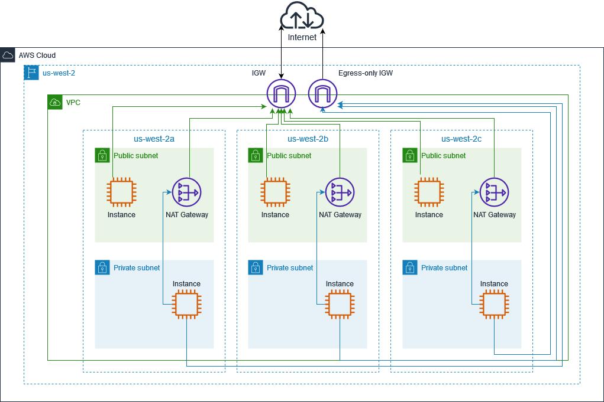

# Dual-stack VPC Internet connectivity
## Architecture Diagram

## VPC
<table>
  <tr>
    <th scope="col">Name</th>
    <th scope="col">VPC ID</th>
    <th scope="col">State</th>
    <th scope="col">IPv4 CIDR</th>
    <th scope="col">IPv6 CIDR</th>
    <th scope="col">Network border group</th>
    <th scope="col">IPv6 pool</th>
    <th scope="col">DHCP options set</th>
    <th scope="col">Main route table</th>
    <th scope="col">Main network ACL</th>
    <th scope="col">Tenancy</th>
    <th scope="col">Default VPC</th>
  <tr>
    <td>example-01</td>
    <td>vpc-099f73fc426d26957</td>
    <td>Available</td>
    <td>10.0.0.0/16</td>
    <td>2600:1f13:a08:b900::/56</td>
    <td>us-west-2</td>
    <td>Amazon</td>
    <td>dopt-11111111111111111</td>
    <td>rtb-09c35a103506738c5</td>
    <td>acl-0f0168ef7d3d443e7</td>
    <td>Default</td>
    <td>No</td>
  </tr>
</table>

## Route tables
### rtb-09c35a103506738c5
This route table is the main route table of the VPC.
<table>
  <tr>
    <th scope="col">Destination</th>
    <th scope="col">Target</th>
  </tr>
  <tr>
    <td>10.0.0.0/16</td>
    <td>local</td>
  </tr>
  <tr>
    <td>2600:1f13:a08:b900::/56</td>
    <td>local</td>
  </tr>
</table>

### rtb-0c8e7519b6336671e / private-rt-us-west-2a
<table>
  <tr>
    <th scope="col">Destination</th>
    <th scope="col">Target</th>
  </tr>
  <tr>
    <td>10.0.0.0/16</td>
    <td>local</td>
  </tr>
  <tr>
    <td>0.0.0.0/0</td>
    <td><b>nat-0dd5d3b83e83ee42d</b></td>
  </tr>
  <tr>
    <td>2600:1f13:a08:b900::/56</td>
    <td>local</td>
  </tr>
  <tr>
    <td>::/0</td>
    <td>eigw-079ea105735cc8704</td>
  </tr>
</table>

### rtb-0c6583ccc89f2b519 / private-rt-us-west-2b
<table>
  <tr>
    <th scope="col">Destination</th>
    <th scope="col">Target</th>
  </tr>
  <tr>
    <td>10.0.0.0/16</td>
    <td>local</td>
  </tr>
  <tr>
    <td>0.0.0.0/0</td>
    <td><b>nat-0cc20d5e4ab2a9e59</b></td>
  </tr>
  <tr>
    <td>2600:1f13:a08:b900::/56</td>
    <td>local</td>
  </tr>
  <tr>
    <td>::/0</td>
    <td>eigw-079ea105735cc8704</td>
  </tr>
</table>

### rtb-052807bfa09954f84 / private-rt-us-west-2c
<table>
  <tr>
    <th scope="col">Destination</th>
    <th scope="col">Target</th>
  </tr>
  <tr>
    <td>10.0.0.0/16</td>
    <td>local</td>
  </tr>
  <tr>
    <td>0.0.0.0/0</td>
    <td><b>nat-0afa39932bbeb0c55</b></td>
  </tr>
  <tr>
    <td>2600:1f13:a08:b900::/56</td>
    <td>local</td>
  </tr>
  <tr>
    <td>::/0</td>
    <td>eigw-079ea105735cc8704</td>
  </tr>
</table>

### Route tables
- rtb-0b1d6e656553b1c56 / public-rt-us-west-2a
- rtb-0c1342a4e9a827beb / public-rt-us-west-2b
- rtb-0b4d6d35989b68386 / public-rt-us-west-2c
<table>
  <tr>
    <th scope="col">Destination</th>
    <th scope="col">Target</th>
  </tr>
  <tr>
    <td>10.0.0.0/16</td>
    <td>local</td>
  </tr>
  <tr>
    <td>0.0.0.0/0</td>
    <td>igw-0f5772b1e81c3b311</td>
  </tr>
  <tr>
    <td>2600:1f13:a08:b900::/56</td>
    <td>local</td>
  </tr>
  <tr>
    <td>::/0</td>
    <td>igw-0f5772b1e81c3b311</td>
  </tr>
</table>
