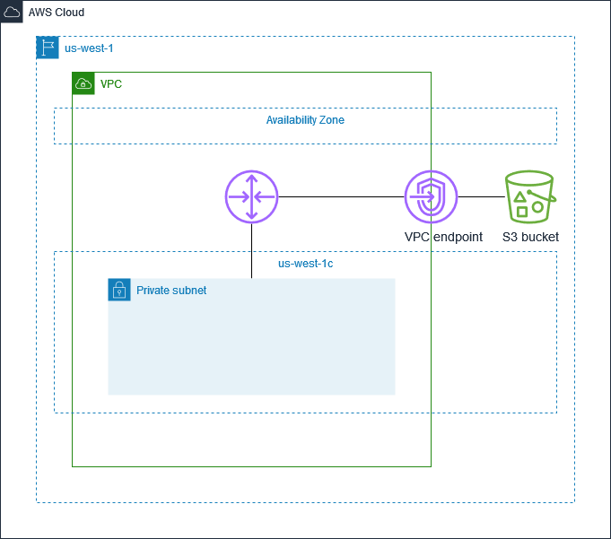

# Create and configure a Gateway VPC Endpoint for Amazon S3

## Architecture Diagram

## Tasks
- Create a Virtual Private Cloud (VPC)
- Create a private subnet in the VPC
- Create a VPC route table named "private" for the private subnet
- Associate the "private" route table with the private subnet
- Create a VPC endpoint policy
- Create a bucket policy
- Create a VPC gateway endpoint for Amazon S3
  - Apply the VPC endpoint policy to the gateway endpoint
  - Specify the `Gateway` VPC endpoint type
  - Specify the appropriate service name
  - Specify the route table ID
    - I used the route table ID of the "private" route table
- Create a S3 bucket
  - Apply the bucket policy to the S3 bucket
  - Versioning is enabled on the bucket
  - The bucket's default encryption is set to SSE-S3
