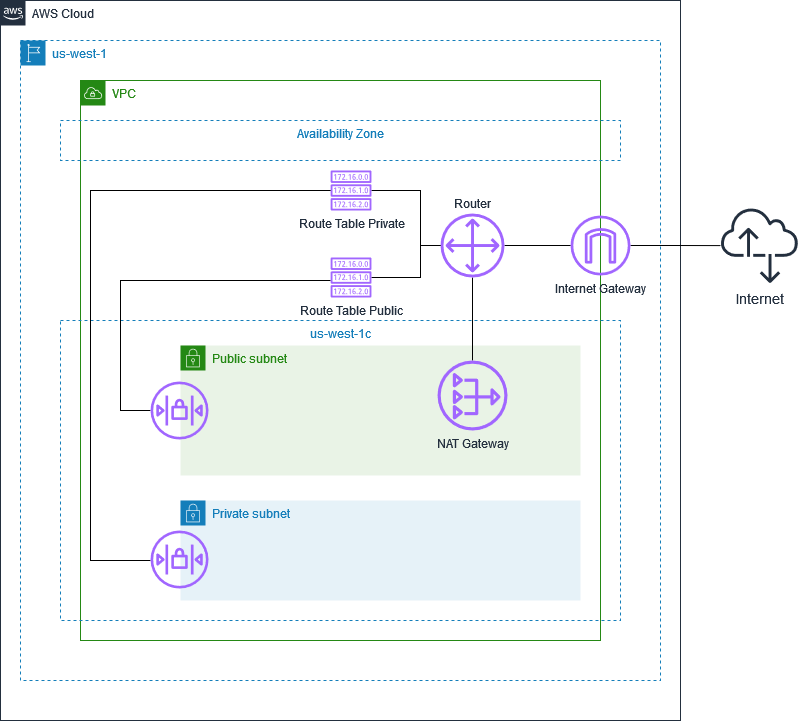

# Enable EC2 instances in a private subnet to establish outbound connections to the Internet

## Architecture Diagram

Note: the identifiers may differ when the Terraform plan is applied.
## VPC
Note: I did not configure the DHCP options set. In addition, I did not choose to use IPv6 in this lab. 
<table>
  <tr>
    <th scope="col">Name</th>
    <th scope="col">VPC ID</th>
    <th scope="col">State</th>
    <th scope="col">IPv4 CIDR</th>
    <th scope="col">IPv6 CIDR</th>
    <th scope="col">IPv6 pool</th>
    <th scope="col">DHCP options set</th>
    <th scope="col">Main route table</th>
    <th scope="col">Main network ACL</th>
    <th scope="col">Tenancy</th>
    <th scope="col">Default VPC</th>
  <tr>
    <td>example-01</td>
    <td>vpc-00893a2aea903b28b</td>
    <td>Available</td>
    <td>172.16.0.0/16</td>
    <td>–</td>
    <td>–</td>
    <td>dopt-11111111</td>
    <td>rtb-05ac8a3fbd34ff31b</td>
    <td>acl-00ac141e6ff549959 / default</td>
    <td>Default</td>
    <td>No</td>
  </tr>

</table>
  
## Main network ACL
Network ACL name: default

Network ACL ID: acl-00ac141e6ff549959
### Inbound rules
<table>
  <tr>
    <th scope="col">Rule number</th>
    <th scope="col">Type</th>
    <th scope="col">Protocol</th>
    <th scope="col">Port range</th>
    <th scope="col">Source</th>
    <th scope="col">Allow/Deny</th>
  </tr>
  <tr>
    <td>100</td>
    <td>Custom TCP</td>
    <td>TCP (6)</td>
    <td>1024 - 65535</td>
    <td>0.0.0.0/0</td>
    <td>Allow</td>
  </tr>
  <tr>
    <td>*</td>
    <td>All traffic</td>
    <td>All</td>
    <td>All</td>
    <td>0.0.0.0/0</td>
    <td>Deny</td>
  </tr>
</table>

### Outbound rules
<table>
  <tr>
    <th scope="col">Rule number</th>
    <th scope="col">Type</th>
    <th scope="col">Protocol</th>
    <th scope="col">Port range</th>
    <th scope="col">Destination</th>
    <th scope="col">Allow/Deny</th>
  </tr>
  <tr>
    <td>100</td>
    <td>HTTP (80)</td>
    <td>TCP (6)</td>
    <td>80</td>
    <td>0.0.0.0/0</td>
    <td>Allow</td>
  </tr>
  <tr>
    <td>110</td>
    <td>HTTPS (443)</td>
    <td>TCP (6)</td>
    <td>443</td>
    <td>0.0.0.0/0</td>
    <td>Allow</td>
  </tr>
  <tr>
    <td>*</td>
    <td>All traffic</td>
    <td>All</td>
    <td>All</td>
    <td>0.0.0.0/0</td>
    <td>Deny</td>
  </tr>
</table>

## Default security group of the VPC
Security group name: default

Security group ID: sg-0903a1ac2fff4ae8d
### Inbound rules
There are no security group rules in this table.
<table>
  <tr>
    <th scope="col">Name</th>
    <th scope="col">Security group rule ID</th>
    <th scope="col">IP version</th>
    <th scope="col">Type</th>
    <th scope="col">Protocol</th>
    <th scope="col">Port range</th>
    <th scope="col">Source</th>
  </tr>
</table>

### Outbound rules
<table>
  <tr>
    <th scope="col">Name</th>
    <th scope="col">Security group rule ID</th>
    <th scope="col">IP version</th>
    <th scope="col">Type</th>
    <th scope="col">Protocol</th>
    <th scope="col">Port range</th>
    <th scope="col">Destination</th>
  </tr>
  <tr>
    <td>–</td>
    <td>sgr-048c09b2e9408aa56</td>
    <td>IPv4</td>
    <td>HTTPS</td>
    <td>TCP</td>
    <td>443</td>
    <td>0.0.0.0/0</td>
  </tr>
  <tr>
    <td>–</td>
    <td>sgr-0f9be3922516f1f1d</td>
    <td>IPv4</td>
    <td>HTTP</td>
    <td>TCP</td>
    <td>80</td>
    <td>0.0.0.0/0</td>
  </tr>
</table>
  
## Subnets
<table>
  <tr>
    <th scope="col">Name</th>
    <th scope="col">Subnet ID</th>
    <th scope="col">State</th>
    <th scope="col">VPC</th>
    <th scope="col">IPv4 CIDR</th>
  </tr>
  <tr>
    <td>public</td>
    <td>subnet-00a1f405d214036f3</td>
    <td>Available</td>
    <td>vpc-00893a2aea903b28b | example-01</td>
    <td>172.16.2.0/24</td>
  </tr>
  <tr>
    <td>private</td>
    <td>subnet-0ac0e3f27080cfa23</td>
    <td>Available</td>
    <td>vpc-00893a2aea903b28b | example-01</td>
    <td>172.16.3.0/24</td>
  </tr>
</table>

## Route tables
<table>
  <tr>
    <th scope="col">Name</th>
    <th scope="col">Route table ID</th>
    <th scope="col">Explicit subnet associations</th>
    <th scope="col">Edge associations</th>
    <th scope="col">Main</th>
    <th scope="col">VPC</th>
  </tr>
  <tr>
    <td>private</td>
    <td>rtb-04b610f88e947f70b</td>
    <td>subnet-0ac0e3f27080cfa23 / private</td>
    <td>–</td>
    <td>No</td>
    <td>vpc-00893a2aea903b28b | example-01</td>
  </tr>
  <tr>
    <td>public</td>
    <td>rtb-0a2f378cfb366d068</td>
    <td>subnet-00a1f405d214036f3 / public</td>
    <td>–</td>
    <td>No</td>
    <td>vpc-00893a2aea903b28b | example-01</td>
  </tr>
</table>

### Routes in route table named "private"
<table>
  <tr>
    <th scope="col">Destination</th>
    <th scope="col">Target</th>
    <th scope="col">Status</th>
    <th scope="col">Propagated</th>
  </tr>
  <tr>
    <td>172.16.0.0/16</td>
    <td>local</td>
    <td>Active</td>
    <td>No</td>
  </tr>
  <tr>
    <td>0.0.0.0/0</td>
    <td>nat-06c1e077aa92efb35</td>
    <td>Active</td>
    <td>No</td>
  </tr>
</table>

### Routes in route table named "public"
<table>
  <tr>
    <th scope="col">Destination</th>
    <th scope="col">Target</th>
    <th scope="col">Status</th>
    <th scope="col">Propagated</th>
  </tr>
  <tr>
    <td>172.16.0.0/16</td>
    <td>local</td>
    <td>Active</td>
    <td>No</td>
  </tr>
  <tr>
    <td>0.0.0.0/0</td>
    <td>igw-0526122bf5e730c60</td>
    <td>Active</td>
    <td>No</td>
  </tr>
</table>	
