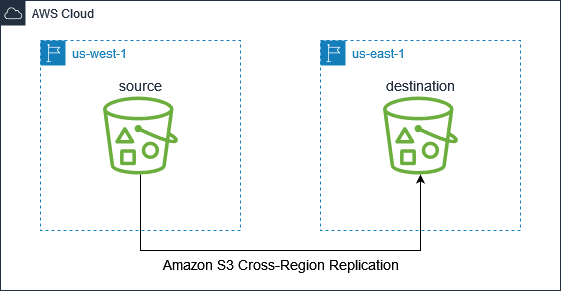

# Configure Amazon S3 Cross Region Replication

## Architecture Diagram

## Tasks
- Create a role for S3 replication, which includes the trust policy for the role and the inline policy attached to the role
- Create an S3 bucket in the `us-west-1` region and another S3 bucket in the `us-east-1` region
- For both buckets, configure S3 Block Public Access
  - Block public access to buckets and objects granted through *new* access control lists (ACLs)
  - Block public access to buckets and objects granted through *any* access control lists (ACLs)
  - Block public access to buckets and objects granted through *new* public bucket or access point policies
  - Block public and cross-account access to buckets and objects through *any* public bucket or access point policies
- Configure both buckets to use SSE-S3 default encryption
- Configure versioning on both buckets (required for Amazon S3 replication)
- Create a replication rule on the source bucket
  - Enable delete marker replication
  - Set the destination bucket for replication
  - Set the S3 storage class to Standard for replicated objects in the destination bucket
